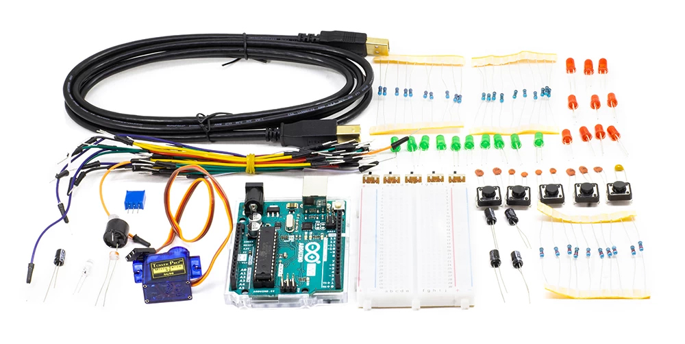

# 2-objetos-electronicos

## Estructura del repositorio

- [clase1.md](clase1.md): miercoles 27 de septiembre
- [clase2.md](clase2.md): lunes 2 de octubre
- [clase3.md](clase3.md): miercoles 4 de octubre
- [ejemplos/](ejemplos/): carpeta con los ejemplos de código.

## Profesor

Sergio Mora-Diaz

## Software

Este módulo se imparte con el software Arduino IDE, disponible para descarga en: https://www.arduino.cc/

En octubre 2023, usaremos la versión 2.2.1

## Bibliografía

- Libro de Proyectos de Arduino
  http://ibsteam.caib.es/wp-content/uploads/sites/108/2020/02/Libro_de_Proyectos_de_Arduino_Starter_Kit.pdf
  
 ## Kit de materiales

