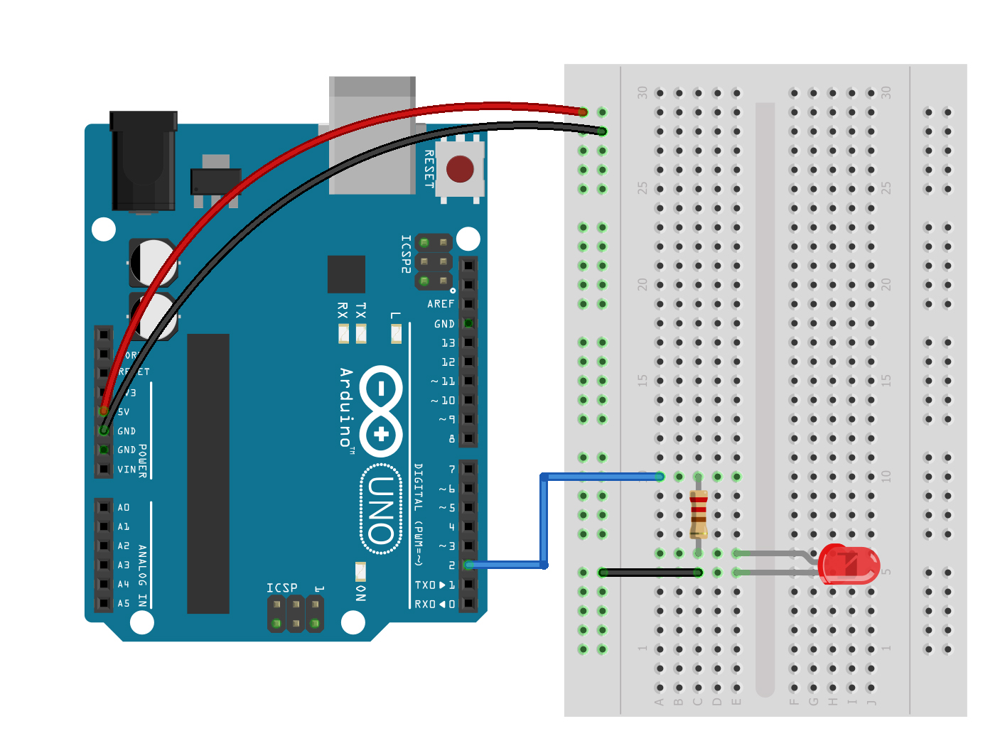
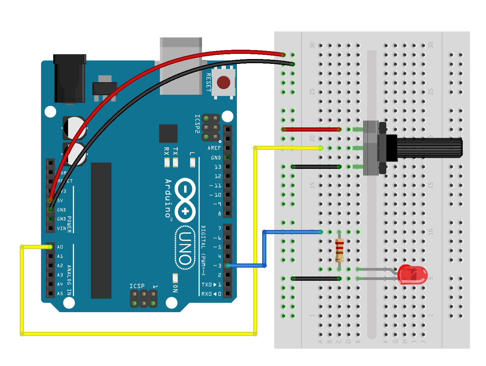

# clase 1

Electrónica y programación con Arduino

Miercoles 10 mayo 2023

Hoy aprenderemos:

- Conceptos de interactividad física
- Introducción a Arduino y componentes electrónicos
- Programación en Arduino: Estructura y variables
- Control digital y analógico circuito LED

## enlace a presentación PDF
- [presentaciones/sinestesia-objetos-electronicos-clase1.pdf](./presentaciones/sinestesia-objetos-electronicos-clase1.pdf)

## enlaces a ejemplos de esta clase

- [ejemplos/ej_01_salida_digital/](./ejemplos/ej_01_salida_digital/)
- [ejemplos/ej_02_entrada_salida_analogica/](./ejemplos/ej_02_entrada_salida_analogica/)

## programa y organización

- Organización: https://github.com/sinestesiacc
- Programa: https://github.com/sinestesiacc/2023-programa-medios-interactivos/
- Berlin code of conduct: https://berlincodeofconduct.org/es/

## presentación de profesor y estudiantes

Direcciones web:

- Studio Sergio Mora-Diaz https://www.sergiomoradiaz.com/ 

Organizaciones:

- Sinestesia Think and Do Tank https://www.sinestesia.cc/
- NYU ITP https://tisch.nyu.edu/itp
- CILUZ https://ciluz.cl/
- The New Media Art https://thenewmediaart.com/
- MANA https://www.manamana.net/
- Choreographic Coding Labs https://choreographiccoding.org/#/
- Derivative TouchDesiner https://derivative.ca/
- MadMapper https://madmapper.com/

## referentes y casos de estudio

- Golan Levin http://www.flong.com/
- Jen Lewin Studio https://www.jenlewinstudio.com/
- Danny Rozin http://www.smoothware.com/danny/
- Rafael Lozano-Hemmer https://www.lozano-hemmer.com/

## interacción y electrónica

- Interacción:

Proceso cíclico en el que dos actores alternativamente escuchan, piensan y hablan. (Chris Crawford, The Art of Interaction Design)

[ escuchar > pensar > hablar ] = [ input > procesamiento > output ]

- Electrónica

Emisión, flujo y control de los electrones. La electrónica permite el procesamiento digital de la información por la capacidad de los dispositivos de actuar como interruptores.

## descargar Arduino IDE y conectar placa

Trabajaremos con el software Arduino IDE, disponible para descarga en: https://www.arduino.cc/

Para el correcto uso de la placa Arduino con el chip CH340G, es necesario además descargar e instalar los drivers disponibles en:

http://www.wch-ic.com/downloads/CH341SER_ZIP.html (Windows) o http://www.wch-ic.com/downloads/CH341SER_MAC_ZIP.html (Mac).

## ejercicio 1: salida digital



[ejemplos/ej_01_salida_digital/](./ejemplos/ej_01_salida_digital/)

## estructura de código

Las funciones principales en Arduino IDE son setup() y draw(), acompañadas de una sessión inicial donde declaramos variables.

```arduino
// declarar variables
int pinLed = 2; // led en pin 2

void setup() {
  // configuracion
  pinMode(pinLed, OUTPUT); // pin en modo salida
}

void loop() {
  // comportamiento
  digitalWrite(pinLed, HIGH); // encender led
}
```
## datos digitales y analógicos

Datos digitales: valores de 1 o 0, dígito binario o bit (2 posibles valores)

Datos analógicos: rangos variables, Arduino procesa datos de 0 a 1023 (2^10)

## ejercicio 2: entrada y salida analógica (potenciómetro)



[ejemplos/ej_02_entrada_salida_analogica/](./ejemplos/ej_02_entrada_salida_analogica/)
