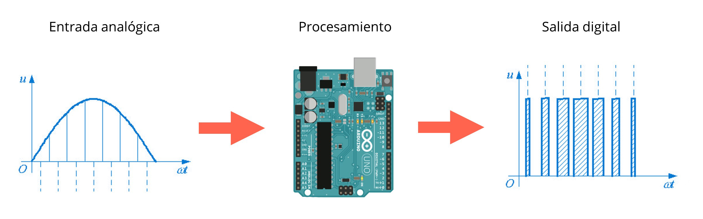

# clase 2

Sensores y actuadores

Miercoles 24 mayo 2023

Hoy aprenderemos:

- Señales analógicas y digitales
- Modulación por ancho de pulsos (PWM)
- Componentes eléctricos, sensores y actuadores
- Sensores de luz, sonido y proximidad
- Programación en Arduino: Condicionales, mapeo de valores

## enlace a presentación PDF
- [presentaciones/sinestesia-objetos-electronicos-clase2.pdf](./presentaciones/sinestesia-objetos-electronicos-clase2.pdf)

## enlaces a ejemplos de esta clase

- [ejemplos/ej_03_rgb_digital/](./ejemplos/ej_03_rgb_digital/)
- [ejemplos/ej_04_rgb_analogico/](./ejemplos/ej_04_rgb_analogico/)

## datos digitales y analógicos

Datos digitales: valores de 1 o 0, dígito binario o bit (2 posibles valores)

Datos analógicos: rangos variables, Arduino procesa datos de 0 a 1023 (2^10)

 
## comunicación serial

Información transmitida en dos direcciones  usando el puerto USB, un dato tras otro.

```arduino
Serial.begin (9600); // iniciar comunicacion serial

Serial.println(datoSensor); // ver datos en monitor
```

## mapeo de valores

```arduino
datoLed = map(datoSensor, 0, 1023, 0, 255); // mapeo de valores
analogWrite(pinLed, datoLed); // escribir datos analogicos
```

0 a 1023 es el rango analógico máximo que entrega un sensor (10 bits).

0 a 255 es el rango de intensidad de brillo de un led, en escala RGB (8 bits).

## condicionales

La información contenida en las llaves se ejecuta sólo al cumplir la condición 

```arduino
if (datoLed <= 0) { // si el dato llega a 0
  cambioLed = 1; // cambio positivo
}
if (datoLed >= 255) { // si el dato llega a 255
  cambioLed = -1; // cambio negativo
}
```

## modulación por ancho de pulsos (PWM ~)

Permite variar tiempo de una señal digital con estado alto o bajo (5V o 0V) para controlar la cantidad de corriente que se entrega a los dispositivos, emulando una señal analógica.



## ejercicio 3: LED RGB y entrada digital (sensor de luz LDR)


[ejemplos/ej_03_rgb_digital/](./ejemplos/ej_03_rgb_digital/)
