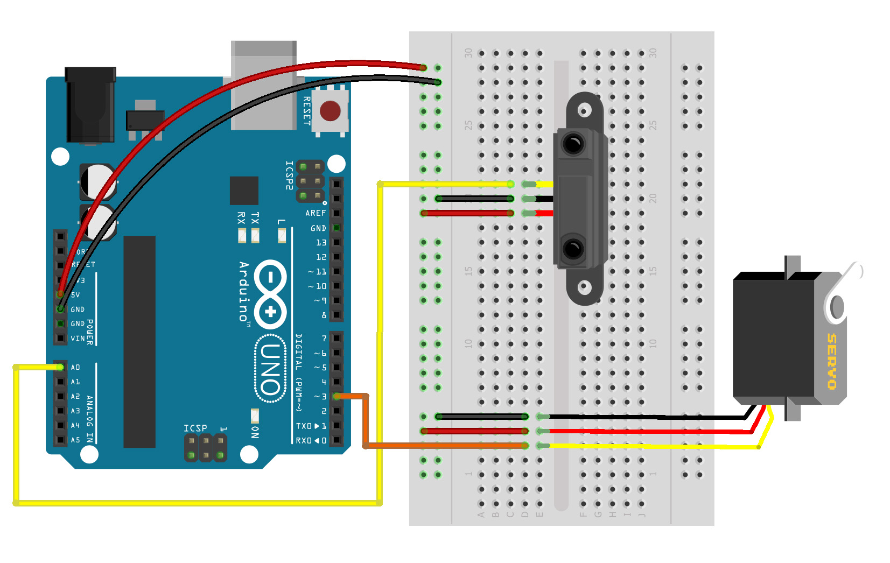

# clase 3

Movimiento, comunicación y autonomía de prototipos

Miercoles 31 mayo 2023

Hoy aprenderemos:

- Sensores de señal analógica
- Uso e instalación de librerías
- Movimiento físico con motor servo
- Autonomía de prototipos electrónicos

## enlace a presentación PDF
- [presentaciones/sinestesia-objetos-electronicos-clase3.pdf](./presentaciones/sinestesia-objetos-electronicos-clase3.pdf)

## enlaces a ejemplos de esta clase

- [ejemplos/ej_04_rgb_analogico/](./ejemplos/ej_04_rgb_analogico/)
- [ejemplos/ej_05_servo_analogico/](./ejemplos/ej_05_servo_analogico/)

## ejercicio 4A: LED RGB y entrada analógica (sensor de sonido)

[ejemplos/ej_04_rgb_analogico/](./ejemplos/ej_04_rgb_analogico/)

## ejercicio 4B: LED RGB y entrada analógica 2 (sensor de proximidad SHARP)

Ambos casos usan el mismo código por usar sensore de entrada analógica en conjunto con un LED.

[ejemplos/ej_04_rgb_analogico/](./ejemplos/ej_04_rgb_analogico/)

## uso e instalación de librerías

#include <Servo.h>   // incluir librería servo
Servo servo1;        // crear objeto servo

## ejercicio 5A: motor servo y entrada analógica (sensor de proximidad SHARP)

[ejemplos/ej_05_servo_analogico/](./ejemplos/ej_05_servo_analogico/)

## ejercicio 5B: motor servo y entrada analógica (potenciómetro)

Ambos casos usan el mismo código por usar sensore de entrada analógica en conjunto con un motor servo.

[ejemplos/ej_05_servo_analogico/](./ejemplos/ej_05_servo_analogico/)
