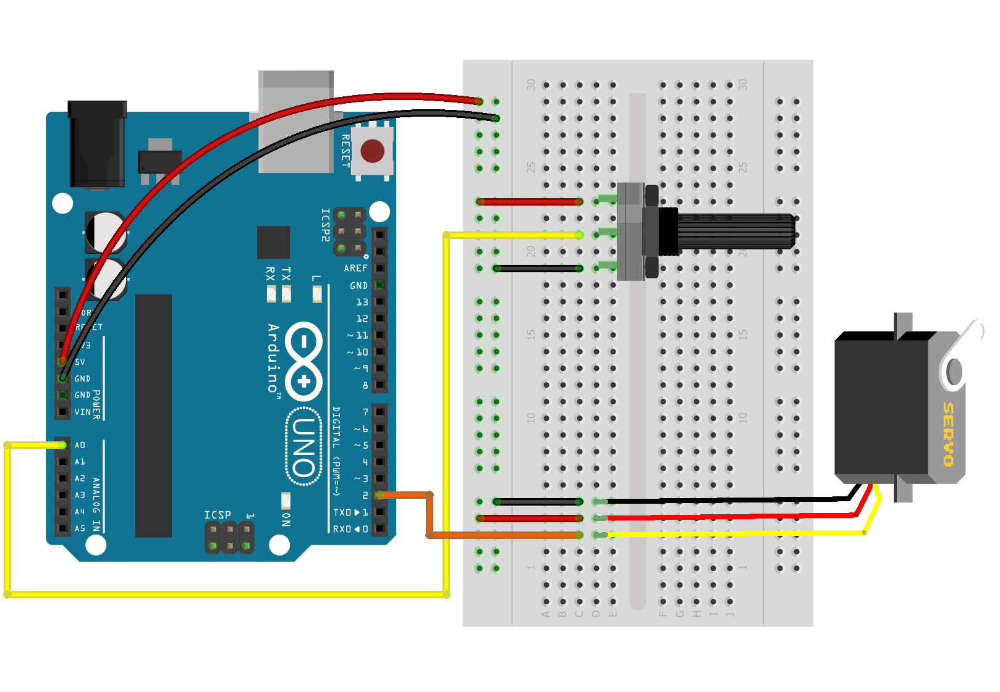
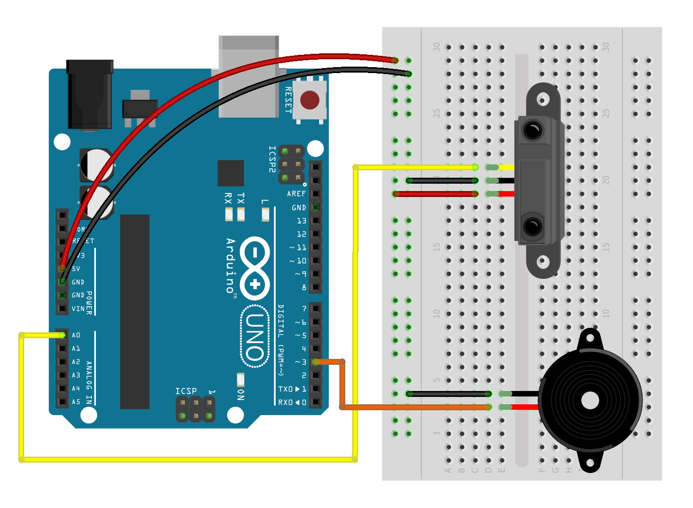
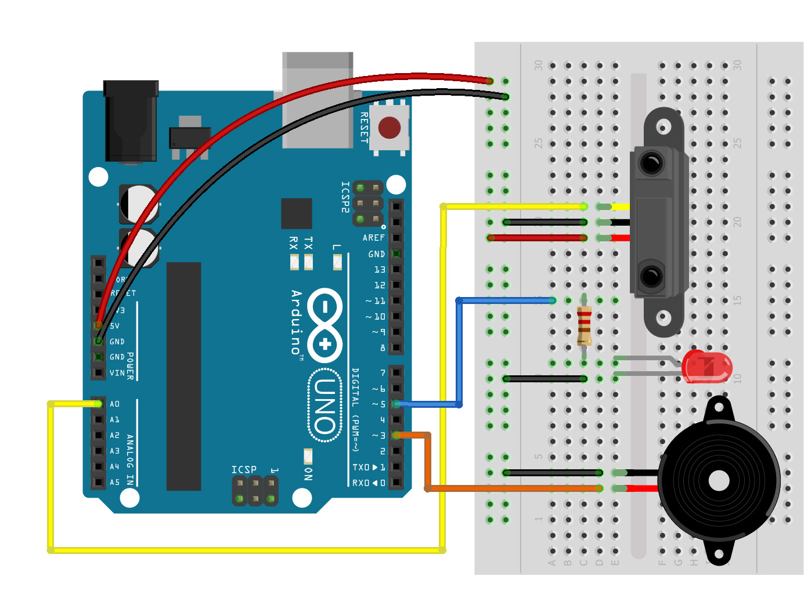

# clase 3

Movimiento, comunicación y autonomía de prototipos

Miercoles 31 mayo 2023

Hoy aprenderemos:

- Sensores de señal analógica
- Uso e instalación de librerías
- Movimiento físico con motor servo
- Sonido con buzzer pasivo
- Autonomía de prototipos electrónicos

## enlace a presentación PDF
- [presentaciones/sinestesia-objetos-clase3.pdf](./presentaciones/sinestesia-objetos-clase3.pdf)

## enlaces a ejemplos de esta clase

- [ejemplos/ej_05_servo_analogico/](./ejemplos/ej_05_servo_analogico/)
- [ejemplos/ej_07_buzzer_analogico_rangos/](./ejemplos/ej_07_buzzer_analogico_rangos/)
- [ejemplos/ej_08_buzzer_led_analogico_rangos/](./ejemplos/ej_08_buzzer_led_analogico_rangos/)

## uso e instalación de librerías

#include <Servo.h>   // incluir librería servo
Servo servo1;        // crear objeto servo

## ejercicio 5: motor servo y entrada analógica (potenciómetro)

[ejemplos/ej_05_servo_analogico/](./ejemplos/ej_05_servo_analogico/)

## ejercicio 6: motor servo y entrada analógica (sensor de proximidad SHARP)

Ambos casos usan el mismo código por usar sensores de entrada analógica en conjunto con un motor servo.
Es necesario ajustar el rango de valores en mapeo.

[ejemplos/ej_05_servo_analogico/](./ejemplos/ej_05_servo_analogico/)

## ejercicio 7: buzzer pasivo y entrada analógica (sensor de proximidad SHARP)

[ejemplos/ej_07_buzzer_analogico_rangos/](./ejemplos/ej_07_buzzer_analogico_rangos/)

## ejercicio 8: buzzer pasivo, LED y entrada analógica (sensor de proximidad SHARP)

[ejemplos/ej_08_buzzer_led_analogico_rangos/](./ejemplos/ej_08_buzzer_led_analogico_rangos/)

